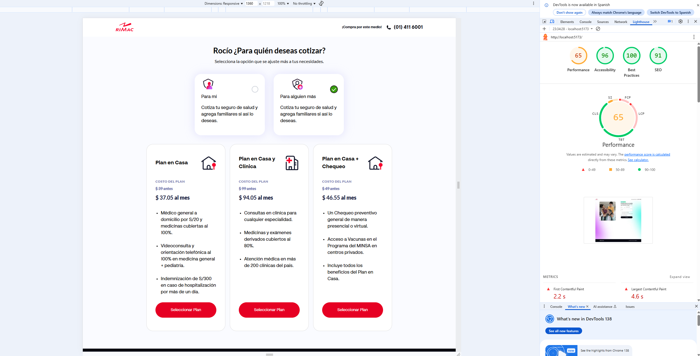

# 🩺 Salud Flexible

**Salud Flexible** es una aplicación web desarrollada con React + TypeScript diseñada para cotizar planes de seguros de salud. Permite a los usuarios ingresar sus datos, seleccionar coberturas y visualizar resultados dinámicamente.

---

## 🚀 Tech Stack

- **Framework:** [React 19](https://reactjs.org/) + [Vite](https://vitejs.dev/)
- **Lenguaje:** TypeScript
- **Estilos:** SCSS Modules
- **Tests:** Vitest + React Testing Library
- **Routing:** React Router DOM
- **Gestión de estado:** Context API (en este proyecto)

---

Enlace al deploy en GitHub Pages (https://nickcoga.github.io/saludflexible/).

---



## 📦 Instalación

1. Clona este repositorio:

```bash
git clone https://github.com/tuusuario/saludflexible.git
cd saludflexible
```

2. Instala las dependencias:

Instala las dependencias:

3. Ejecutar en desarrollo

npm run dev

4. Pruebas unitarias

npm run test

Esto ejecutará los tests utilizando Vitest.

Cobertura de test implementada:
Checkbox: validación de renderizado y eventos

InputText: validación de entrada numérica y eventos.

Compatible para todos los navegadores en windows, linux y celulares Android sin embargo debido al consumo de data de terceros por las Api externas
Apple no permite por permisos de CORS y seguridad el consumo de data en IOs (Iphone, Mac).

Creado por [Nick Correa Garcia].

Licencia
Este proyecto está licenciado bajo MIT.
